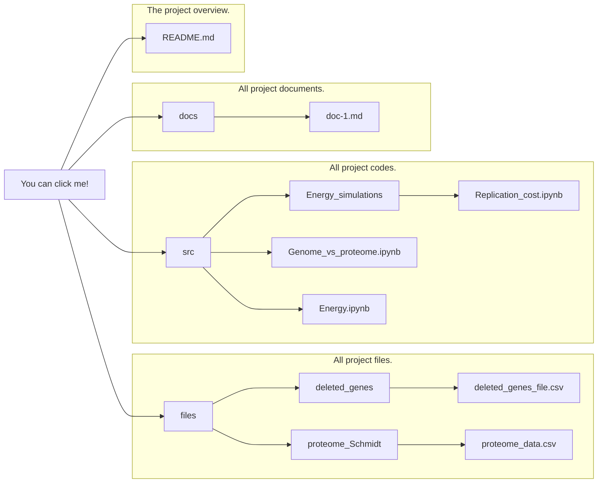

# Resource allocation in minimized cells: is genome reduction the best strategy? 🧬


# Cell Resource Minimization Strategies

This repository contains the source code and data for the paper **"Engineering Resource Allocation in Artificially Minimized Cells: Is Genome Reduction the Best Strategy?"**. The goal of this project is to analyze genome and proteome reduction strategies in *E. coli* to optimize resource allocation.

## Table of Contents

- [Overview](#overview)
- [Repository Structure](#repository-structure)
- [How to Use the Code](#how-to-use-the-code)
- [Notebooks Workflow](#notebooks-workflow)
- [File Description](#file-description)
- [Citing the Project](#citing-the-project)

## Overview

This project explores the computational modeling of resource savings from genome and proteome reduction strategies in *Escherichia coli* using a proteomics dataset and a genome-scale ME-model. The objective is to determine whether genome or proteome reduction is the best strategy for minimizing cellular resource consumption, particularly energy in terms of ATP.

## Repository Structure

```
root
│
├── docs/                          # Documentation files
│   └── relevant_document.md
│
├── src/                           # Source code and notebooks
│   ├── Energy_simulations/
│   │   └── (Notebooks related to specific energy costs)
│   ├── Energy.ipynb               # Energy calculations notebook
│   ├── Genome_vs_proteome.ipynb   # Comparison of genome and proteome reduction
│   ├── plot_energy.py             # Scripts for plotting energy results
│   └── get_gene_info.py           # Script for gene information retrieval
│
├── files/                         # Data generated or processed by notebooks
│   ├── deleted_genes/
│   ├── deleted_ranges/
│   ├── ecolime_data/
│   └── proteome_Schmidt/          # Proteome datasets used in analysis
│
└── README.md                      # This file
```




## How to Use the Code

To use the code and run the simulations:

1. Clone the repository:
   ```
   git clone https://github.com/utrillalab/Cell_Resource_Minimization_Strategies
   ```
2. Install the necessary Python dependencies:
   ```
   pip install -r requirements.txt
   ```

3. Run the notebooks in the following recommended order (see the next section for details).

## Notebooks Workflow

The following Jupyter notebooks contain the main analysis and simulations. They should be followed in this order to understand the process:

1. **Energy.ipynb**: This notebook introduces the initial energy cost calculations for replication, transcription, and translation of genes in the ME-model.
2. **Genome_vs_proteome.ipynb**: Compares resource savings from genome and proteome reduction strategies. Generates data that is saved in the `files/` directory.
3. **Replication_cost.ipynb, Transcription_cost.ipynb, UPF_cost.ipynb** (under `Energy_simulations/`): These notebooks detail the costs of specific cellular processes related to resource allocation.

## File Description

The `files/` directory contains output files generated from the notebooks. Here is a brief description of each subdirectory:

- `deleted_genes/`: Contains information about genes removed during genome reduction.
- `deleted_ranges/`: Defines the ranges of genome deletions used in different simulations.
- `ecolime_data/`: Contains codon usage data and other *E. coli* specific datasets.
- `proteome_Schmidt/`: Contains proteomic data from Schmidt et al., used in the analysis to calculate the proteome savings.

## Citing the Project

If you use this repository or data in your work, please cite the original paper:

```
Marquez-Zavala, E. & Utrilla, J. (2023) Engineering resource allocation in artificially minimized cells: Is genome reduction the best strategy? Microbial Biotechnology.
```


