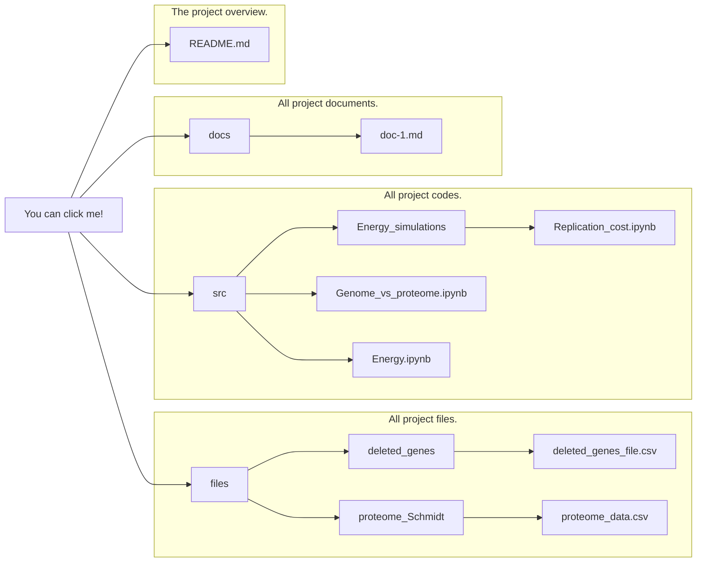

# Resource allocation in minimized cells: is genome reduction the best strategy? 🧬

This repository contains the source code and data for the paper **"Engineering Resource Allocation in Artificially Minimized Cells: Is Genome Reduction the Best Strategy?"**. The goal of this project is to analyze genome and proteome reduction strategies in *E. coli* to optimize resource allocation.

## Table of Contents

- [Overview](#overview)
- [Repository Structure](#repository-structure)
- [How to Use the Code](#how-to-use-the-code)
- [Notebooks Workflow](#notebooks-workflow)
- [File Description](#file-description)
- [Citing the Project](#citing-the-project)

## Overview

This project explores the computational modeling of resource savings from genome and proteome reduction strategies in *Escherichia coli* using a proteomics dataset and a genome-scale ME-model. The objective is to determine whether genome or proteome reduction is the best strategy for minimizing cellular resource consumption, particularly energy in terms of ATP.

## Repository Structure

```
root
│
├── docs/                          # Documentation files
│   └── relevant_document.md
│
├── src/                           # Source code and notebooks
│   ├── Energy_simulations/        # Additional simulations (Replication, Transcription, UPF costs)
│   ├── Energy.ipynb               # Notebook for energy consumption analysis in ME model
│   ├── Genome_vs_proteome.ipynb   # Comparison of genome and proteome reduction
│   ├── Multipanel_Energy_protReleased_Energy.pdf # Energy plot outputs
│   ├── Prot_vs_Genome.pdf         # Genome vs Proteome comparison plot
│   ├── __init__.py                # Package initialization file
│   ├── energy_analisis.py         # Functions for energy analysis in ME model
│   ├── get_gene_info.py           # Functions to get genome information
│   ├── get_proteome_info.py       # Functions to get proteomic information
│   ├── plot_energy.py             # Functions for energy-related plotting
│   └── plot_proteome.py           # Functions for proteome-related plotting
│
├── files/                         # Data generated or processed by notebooks
│   ├── deleted_genes/
│   ├── deleted_ranges/
│   ├── ecolime_data/
│   ├── energy/
│   ├── genomes/
│   ├── models/
│   └── proteome_Schmidt/          # Proteome datasets used in analysis
│
└── README.md                      # This file
```





## Notebooks Workflow

The Jupyter notebooks are the main computational tools for this project. Here is the recommended order to follow them:

1. **[Energy_simulations/](src/Energy_simulations/)**:
   Notebooks to simulate the ATP costs for replication, transcription, and UPF (Universal Protein Fraction). These are referenced by the main notebooks:
   - `Replication_cost.ipynb`
   - `Transcription_cost.ipynb`
   - `UPF_cost.ipynb`
   - **Output**: Generates data files related to ATP consumption and visualizes the energy costs per strain.

1. **[Energy.ipynb](src/Energy.ipynb)**: 
   This notebook analyzes the ATP consumption per reaction, gene, and strain using the ME model. It also takes into account the ATP costs for replication, transcription, and protein production processes obtained from src/Energy_simulation.
   - **Output**: Generates data files related to ATP consumption and visualizes the energy costs per strain.
   
2. **[Genome_vs_proteome.ipynb](src/Genome_vs_proteome.ipynb)**: 
   Compares genome and proteome reduction strategies by calculating how much energy and proteome load can be saved by eliminating non-essential genes.
   - **Output**: Generates data files and plots comparing genome and proteome reductions.


## Scripts Description

The `src/` directory contains Python scripts used for energy calculations and data analysis.

1. **energy_analisis.py**:
   - Contains functions to calculate energy consumption per reaction, per gene, and total energy costs for minimized strains.
   - Key Functions:
     - `get_energy_consumption_production(me)`: Retrieves ATP consumption and production for each reaction in the ME model.
     - `get_energy_per_gene()`: Calculates ATP consumption per gene based on reaction data.

2. **plot_energy.py**:
   - Functions for plotting energy consumption at various levels, including per strain and per gene.
   - Key Functions:
     - `plot_ME_energy()`: Visualizes energy consumption by strain.
     - `plot_type_energy()`: Plots ATP consumption for different reaction types.

3. **get_gene_info.py**:
   - Functions for extracting genome information from GenBank files and mapping deleted genes to specific strains.

4. **get_proteome_info.py**:
   - Functions for working with proteomics datasets to calculate proteome load based on gene deletions.

5. **plot_proteome.py**:
   - Functions for plotting the distribution of proteome load across conditions.

## Generated Files

Running the notebooks and scripts will generate several output files, mostly saved in the `files/` directory:

- **Deleted Genes**: Information on genes deleted in minimized strains.
- **Energy**: Data related to ATP consumption per reaction, gene, and strain.
  - `../files/energy/energy_per_reaction.pickle`
  - `../files/energy/energy_per_gene.pickle`
- **Proteome**: Data on proteome distributions from Schmidt et al. (2016).
- **Plots**: Generated visualizations, including energy consumption and proteome load plots.
  - `Multipanel_Energy_protReleased_Energy.pdf`
  - `Prot_vs_Genome.pdf`
  
## File Description

The `files/` directory contains output files generated from the notebooks. Here is a brief description of each subdirectory:

- `deleted_genes/`: Contains information about genes removed during genome reduction.
- `deleted_ranges/`: Defines the ranges of genome deletions used in different simulations.
- `ecolime_data/`: Contains codon usage data and other *E. coli* specific datasets.
- `proteome_Schmidt/`: Contains proteomic data from Schmidt et al., used in the analysis to calculate the proteome savings.

## Citing the Project

If you use this repository or data in your work, please cite the original paper:

```
Marquez-Zavala, E. & Utrilla, J. (2023) Engineering resource allocation in artificially minimized cells: Is genome reduction the best strategy? Microbial Biotechnology.
```


