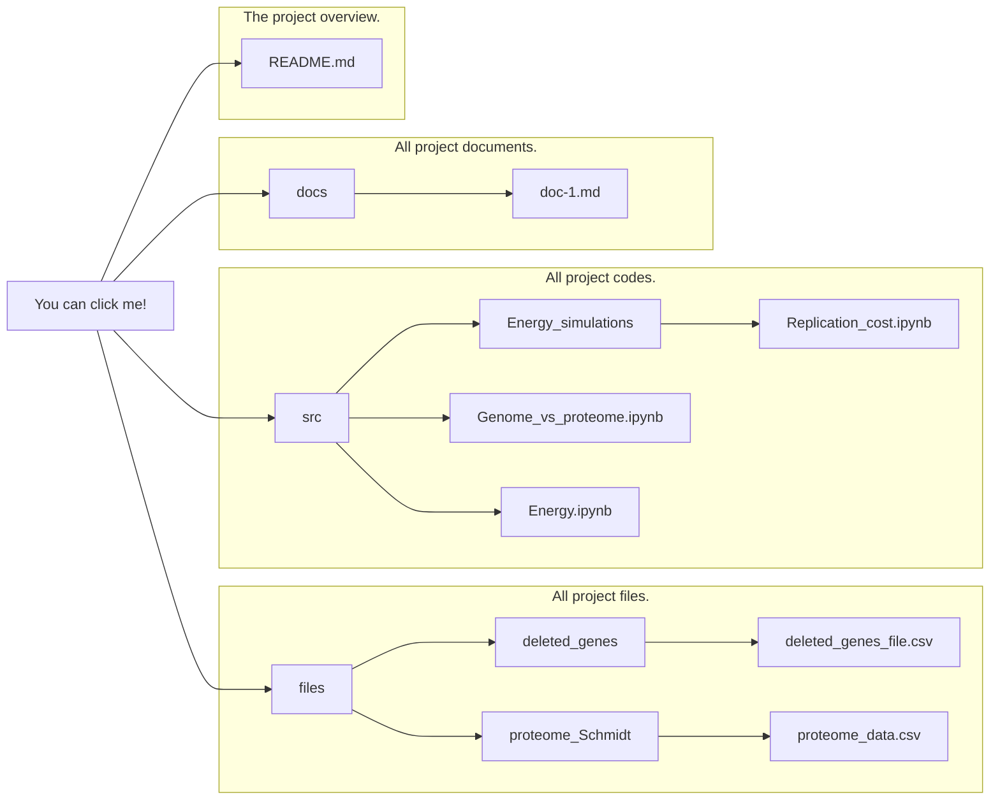
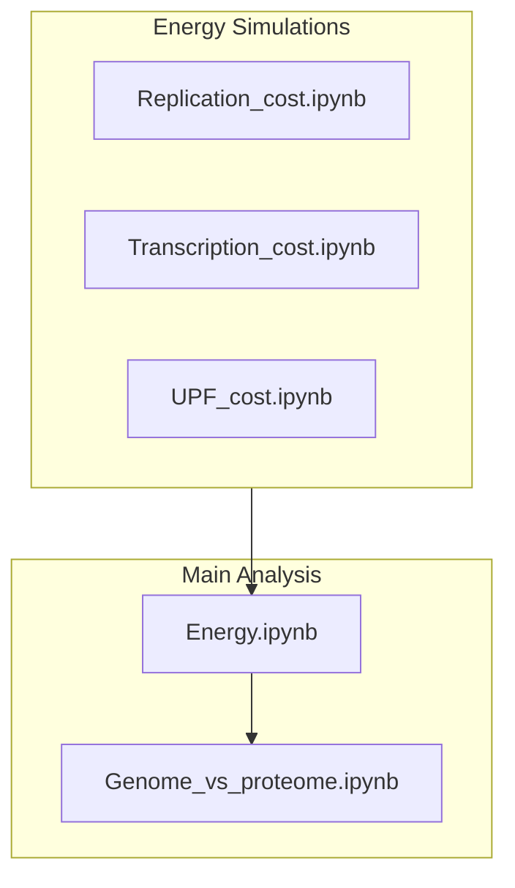

# Resource Allocation in Minimized Cells: Is Genome Reduction the Best Strategy? 🧬
This repository contains the source code, data, and Jupyter notebooks for the paper **"Engineering Resource Allocation in Artificially Minimized Cells: Is Genome Reduction the Best Strategy?"**. The objective of this project is to explore genome and proteome reduction strategies in *E. coli* to optimize cellular resource allocation.

## Table of Contents
- [Visual Summary](#visual-summary)
- [Overview](#overview)
- [Repository Structure](#repository-structure)
- [How to Use the Code](#how-to-use-the-code)
- [Notebooks Workflow](#notebooks-workflow)
- [Scripts Description](#scripts-description)
- [Generated Files](#generated-files)
- [File Description](#file-description)
- [Citing the Project](#citing-the-project)

## Visual Summary


## Table of Contents

- [Overview](#overview)
- [Repository Structure](#repository-structure)
- [How to Use the Code](#how-to-use-the-code)
- [Notebooks Workflow](#notebooks-workflow)
- [Scripts Description](#scripts-description)
- [Generated Files](#generated-files)
- [File Description](#file-description)
- [Citing the Project](#citing-the-project)

## Overview

This project investigates the computational modeling of resource savings from genome and proteome reduction strategies in *Escherichia coli* using proteomics data and a genome-scale ME-model. The primary focus is to assess whether genome or proteome reduction is more efficient for minimizing cellular energy consumption (ATP usage).

## Repository Structure

```
root
│
├── docs/                          # Documentation files
│   └── relevant_document.md
│
├── src/                           # Source code and notebooks
│   ├── README.md                  # Overview of source code
│   ├── Energy_simulations/        # Additional simulations (Replication, Transcription, UPF costs)
│   │   └── README.md              # Overview of energy simulations
│   ├── Energy.ipynb               # Notebook for energy consumption analysis in the ME model
│   ├── Genome_vs_proteome.ipynb   # Comparison of genome and proteome reduction
│   ├── Multipanel_Energy_protReleased_Energy.pdf # Energy plot outputs
│   ├── Prot_vs_Genome.pdf         # Genome vs Proteome comparison plot
│   ├── __init__.py                # Package initialization file
│   ├── energy_analisis.py         # Functions for energy analysis in the ME model
│   ├── get_gene_info.py           # Functions to get genome information
│   ├── get_proteome_info.py       # Functions to get proteomic information
│   ├── plot_energy.py             # Functions for energy-related plotting
│   └── plot_proteome.py           # Functions for proteome-related plotting
│
├── files/                         # Data generated or processed by notebooks
│   ├── README.md                  # Overview of files and their purposes
│   ├── deleted_genes/             # Deleted genes information
│   ├── deleted_ranges/            # Deleted ranges information
│   ├── ecolime_data/              # Codon usage data
│   ├── energy/                    # Energy consumption data
│   ├── genomes/                   # Genomic data
│   ├── models/                    # ME models for various simulations
│   └── proteome_Schmidt/          # Proteome datasets used in the analysis
│
└── README.md                      # This file
```



## How to Use the Code

1. **Clone the repository**:
   ```bash
   git clone https://github.com/utrillalab/Cell_Resource_Minimization_Strategies
   ```

2. **Install dependencies**:
   If you're using Conda, you can create the environment from the `environment.yml` file:
   ```bash
   conda env create -f environment.yml
   conda activate cell-resource-env
   ```
   Or, manually install dependencies using `pip`:
   ```bash
   pip install -r requirements.txt
   ```

3. **Run the notebooks**:
   The recommended order for running the notebooks is detailed below.

## Notebooks Workflow

The Jupyter notebooks are the primary computational tools for this project. Follow the steps in the recommended order:

1. **[Energy_simulations/](src/Energy_simulations/)**:
   This directory contains additional simulations for the ATP costs of specific cellular processes:
   - `Replication_cost.ipynb`: Simulates ATP costs for DNA replication.
     - **Inputs**: 
       - `../../files/models/iJL1678b.pickle` (original model).
       - Percent DNA data: `[1, 1.125, 1.25, 1.5]`.
     - **Outputs**: Models saved as `../../files/models/DNA_per{value}.pickle` with modified DNA percentages.

   - `Transcription_cost.ipynb`: Simulates ATP costs for transcription processes.
     - **Inputs**: 
       - `../../files/models/iJL1678b.pickle` (original model).
       - `../../files/ecolime_data/codon_usage.csv` (codon usage data).
       - Genes added (Approximately a 5%, 10%, 15%, and 20% of the 4600 genes): `[230,460,690,920]`.
     - **Outputs**: Models saved as `../../files/models/AumGenes_GLC_OX_{number}.pickle` with added transcribed genes.

   - `UPF_cost.ipynb`: Simulates ATP costs for protein production (Universal Protein Fraction - UPF).
     - **Inputs**: 
       - `../../files/models/iJL1678b.pickle` (original model).
       - UPF new values:  `[0.24, .27, 0.30, .33, 0.36]`.
     - **Outputs**: Models saved as `../../files/models/ATPM_UPF_OX_GLC{UPF_value}.pickle` with different UPF settings.

2. **[Energy.ipynb](src/Energy.ipynb)**: 
   This notebook is the core analysis of ATP consumption, including per reaction, gene, and strain using the ME model. It also factors in ATP costs from replication, transcription, and protein production (results from `Energy_simulations/`).
   - **Inputs**:
     - `../files/models/iJL1678b_solver.pickle` (solved ME model).
     - Data files from the energy simulation outputs.
   - **Outputs**: ATP consumption data, strain energy cost visualizations, and saved files:
     - `../files/energy/energy_per_reaction.pickle`
     - `../files/energy/energy_per_gene.pickle`
     - `../files/energy/Costs_L&M_ME.csv`

3. **[Genome_vs_proteome.ipynb](src/Genome_vs_proteome.ipynb)**: 
   This notebook compares genome and proteome reduction strategies by calculating the energy and proteome load savings from eliminating non-essential genes.
   - **Inputs**: 
     - Deleted genes files for specific strains from `../files/deleted_genes/`.
     - Deleted ranges files from `../files/deleted_ranges/`.
     - Proteomic data files from `../files/proteome_Schmidt/`.
   - **Outputs**: 
     - Data files and plots that compare genome vs proteome reductions.
     - `../files/proteome_genome/protVSgen.csv`



## Scripts Description

The `src/` directory contains several Python scripts used for energy analysis:

1. **energy_analisis.py**:
   - Functions to calculate energy consumption per reaction, per gene, and overall energy costs for minimized strains.
   - Key Functions:
     - `get_energy_consumption_production(me)`: Retrieves ATP consumption and production for reactions in the ME model.
     - `get_energy_per_gene()`: Calculates ATP consumption per gene.

2. **plot_energy.py**:
   - Functions for plotting energy consumption at various levels (e.g., per strain, per gene).
   - Key Functions:
     - `plot_ME_energy()`: Visualizes energy consumption by strain.
     - `plot_type_energy()`: Plots ATP consumption for different reaction types.

3. **get_gene_info.py**:
   - Functions to extract genome information from GenBank files and map deleted genes to specific strains.

4. **get_proteome_info.py**:
   - Functions for working with proteomics datasets to calculate proteome load based on gene deletions.

5. **plot_proteome.py**:
   - Functions to plot the distribution of proteome load across various conditions.

## Generated Files

Running the notebooks and scripts will generate several output files, saved mainly in the `files/` directory:

- **Deleted Genes**: Information on genes removed during genome reduction.
- **Energy**: Data related to ATP consumption per reaction, gene, and strain.
  - `../files/energy/energy_per_reaction.pickle`
  - `../files/energy/energy_per_gene.pickle`
- **Proteome**: Data on proteome distributions from Schmidt et al. (2016).
- **Plots**: Visualizations of energy consumption and proteome load.
  - `Multipanel_Energy_protReleased_Energy.pdf`
  - `Prot_vs_Genome.pdf`

## File Description

The `files/` directory contains output files generated from the notebooks. Below is a brief description of the key directories:

- `deleted_genes/`: Information about genes removed during genome reduction.
- `deleted_ranges/`: Defines the genome deletion ranges used in the simulations.
- `ecolime_data/`: Contains codon usage data and other *E. coli* specific datasets.
- `energy/`: Contains energy consumption data and related files.
- `genomes/`: Contains genomic data.
- `models/`: Stores ME models for various simulations.
- `proteome_Schmidt/`: Contains proteomic data used in the analysis.

## Citing the Project

If you use this repository or data in your work, please cite the original paper:

```
Marquez-Zavala, E. & Utrilla, J. (2023) Engineering resource allocation in artificially minimized cells: Is genome reduction the best strategy? Microbial Biotechnology.
```
